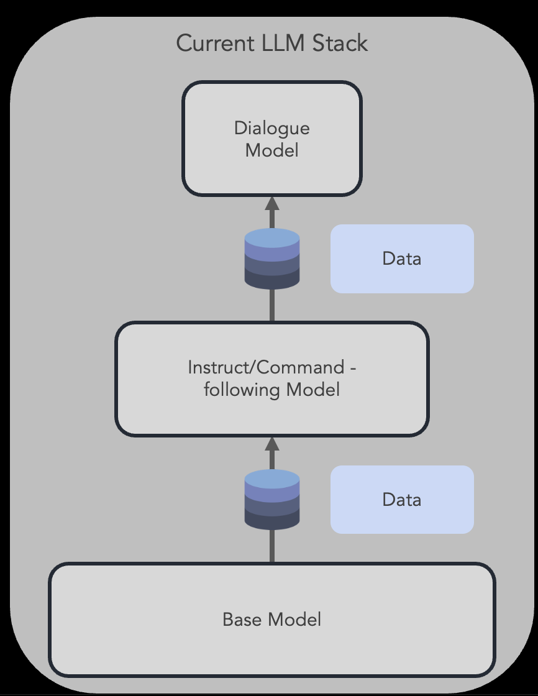
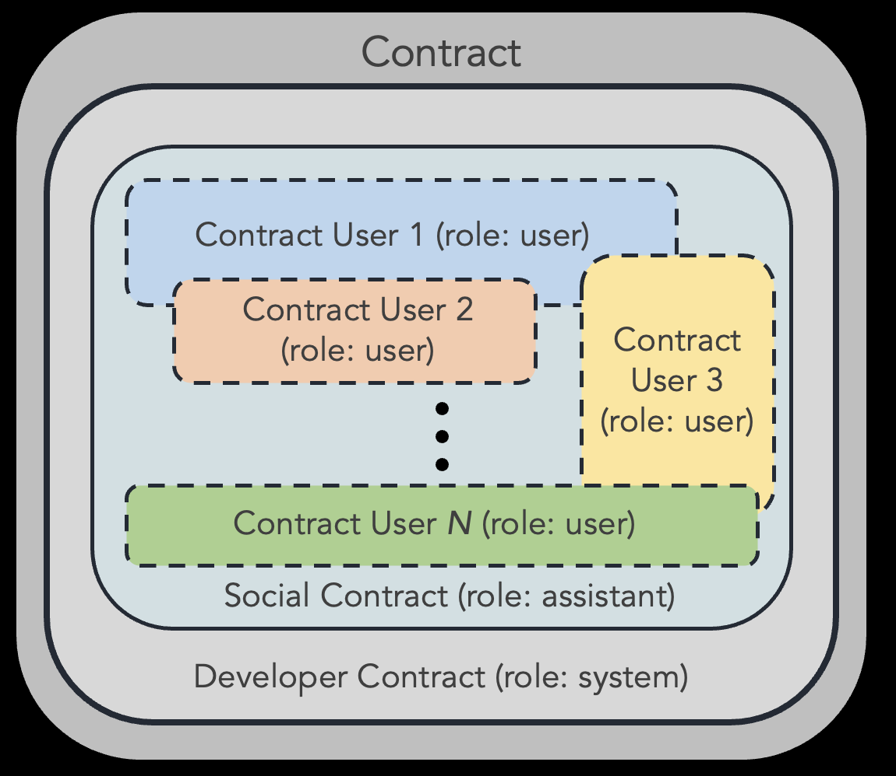
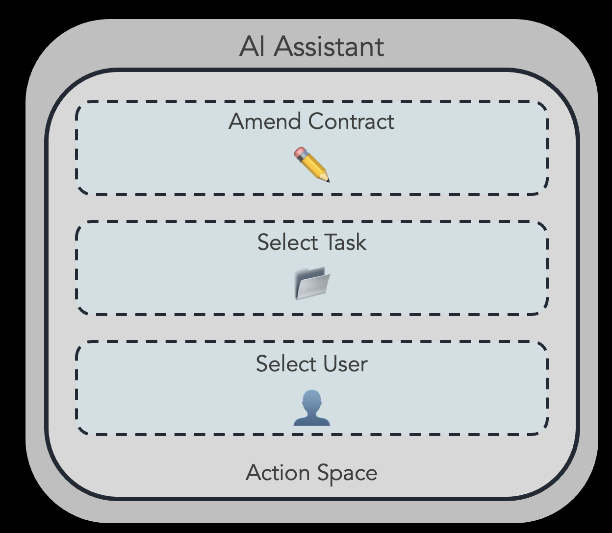

##  🕉️ SCAI: Social Contract AI

Useful, self-improving language agents. Insipred by [meta-prompt](https://noahgoodman.substack.com/p/meta-prompt-a-simple-self-improving). Written in [LangChain](https://github.com/hwchase17/langchain).

#### ‼️@dev team: Please read the [documentation](#documentation) below.
 
#### 📖 Background
Large Language Models (LLMs) are exciting 🚀😍. However, as these models continue to advance, current fine-tuning methods that depend on human oversight [e.g. [1](https://proceedings.neurips.cc/paper_files/paper/2022/file/b1efde53be364a73914f58805a001731-Paper-Conference.pdf)] might become less effective [e.g. [2](https://arxiv.org/pdf/1606.06565.pdf), [3](https://arxiv.org/pdf/2211.03540.pdf), [4](https://arxiv.org/pdf/2212.08073.pdf)]. This opens up exciting new possibilities for self-improvement methods [e.g. [5](https://noahgoodman.substack.com/p/meta-prompt-a-simple-self-improving)].

    

#### The SCAI Approach

##### The Contract

    

##### Stage 1: Self-improvement with meta-prompting

###### System

###### Assistant

    

###### User(s)

##### Stage 2: Fine-tuning on self-generated data
tbd

### 📖 Documentation

#### Updating Docs (/docs)
Currently only available locally.

To build docs from source/open docs, run:
`sphinx-build -b html docs/source docs/build`. Thereafter, run `open docs/build/index.html` to open docs. 

As we are working on this in a bigger team, its important to keep this up to date.

When you are adding a new class or make modifications to an important functionality, please document them in `docs/source`. 
E.g., if you changed smth to a model class such as the `assistant`, please document this in `docs/source/models/models.rst`.

Thereafter, run `sphinx-build -b html docs/source docs/build` to update the docs.

#### Getting started 
Install miniconda e.g. 
1. `curl -O https://repo.anaconda.com/miniconda/Miniconda3-latest-MacOSX-x86_64.sh`
2. `bash Miniconda3-latest-MacOSX-x86_64.sh`
3. close and reopen terminal
4. `source ~/.bashrc`

Create a virtual environment with a python version such as 3.10, e.g. 
1. `conda create --name name-of-my-env python==3.10`
2. `conda activate name-of-my-env`
3. `pip install -r requirements.txt`

