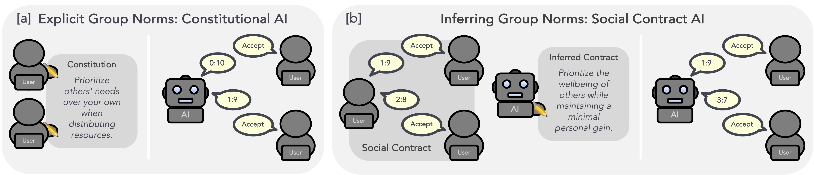

##  🕉️ Social Contract AI: Aligning AI Assistants with Implicit Group Norms


### 🧐 What is this?
SCAI is a simulator for aligning an AI assistant with language feedback/verbal reinforcement [[1](https://github.com/ngoodman/metaprompt), [2](https://arxiv.org/abs/2303.11366), [3](https://arxiv.org/abs/2310.02304)] (work in progress).



### 📂 Repro structure
```
├── src                  
│   └── scai      
│       ├── chat_models
│       ├── games
│       └── memory       
├── experiments    
│   ├── ultimatum_simulation
│   ├── buyer_seller
│   └── red_teaming
├── LICENSE              
├── requirements.txt    
├── pyproject.toml    
├── setup.py    
└── .gitignore           
```

#### 🚀 Getting started 
##### Using miniforge
1. install miniforge from `https://github.com/conda-forge/miniforge` (eg `Miniforge3-MacOSX-arm64`)
2. `bash Miniforge3-MacOSX-arm64.sh`
3. close terminal
4. `conda create --name scai python==3.10`
5. `conda activate scai`
6. `pip install -e .` 